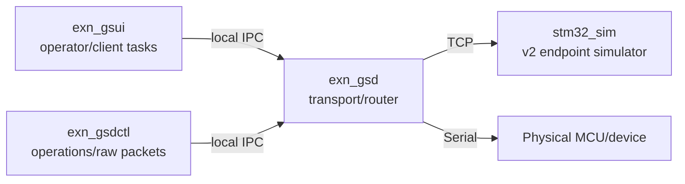

# EXN-GS

**EXN-GS** is the host-side ground-control and hardware-in-the-loop environment for the EXN avionics demonstrator. It provides a C++17 transport daemon, FTXUI operator client, command-line client, and STM32-oriented simulator for CCSDS/PUS traffic over Serial or TCP.

## Current protocol baseline

- CCSDSPack v2.x, with v2.0.0 as the reproducible fallback baseline;
- CCSDS Space Packet version 0;
- PUS revision A TC/TM secondary headers;
- one-octet TC source ID and zero-octet TM destination ID;
- CRC-16/CCITT-FALSE packet error control;
- TC APID = destination endpoint;
- TM APID = producing endpoint.

The mission wire contract is maintained in the `ExoSpaceLabs/exn` repository under `docs/ICD.md` and `interfaces/`.

## Architecture



### `exn_gsd`: transport/router

The daemon owns infrastructure and transport operations:

- Serial/TCP device-link lifecycle;
- ordered device-link writes and reconnect handling;
- CCSDS byte-stream framing;
- structural packet validation before forwarding;
- direction-agnostic Space Packet routing between IPC clients and the device link;
- packet metadata, logging, state distribution, and transport counters over IPC.

The daemon does **not** own mission schedules, periodically generate housekeeping, assign mission transaction IDs, synthesize time packets, or decide which PUS application services should run.

Supported daemon operations are intentionally small:

- `CONNECT` — open the configured device transport;
- `DISCONNECT` — close it;
- `RECONNECT` — cleanly cycle it;
- `PING` — daemon IPC liveness check, returns `PONG`;
- `STATUS` — return current device-link state;
- `STATS` — return RX/TX byte/packet and decode/framing counters;
- `PacketSend` — route one complete structurally valid CCSDS Space Packet.

New IPC sessions receive both a daemon `Hello` and the current device-link state. The two concepts are deliberately separate: **daemon IPC can be connected while the spacecraft/device link is disconnected or in error**.

### `exn_gsui`: operator/application client

The UI owns operator/application behavior, including:

- CCSDSPack v2 packet construction;
- client-side packet sequence state;
- System HK transaction IDs;
- the optional periodic System HK task;
- one-shot mission requests initiated by the operator.

The UI displays `Daemon IPC` and `Device Link` independently. Daemon errors/messages are shown on the status line and do not overwrite transport state.

Current System HK behavior sends TC `3/10` every two seconds while the UI task is enabled **and** both daemon IPC and device link are connected. The packet is addressed to MCU APID `0x100`, uses GS Source ID `0x10`, and carries exactly `{transactionId:u16, include_mask:u8, detailMask:u16}` with no downstream proxy preamble.

### `stm32_sim`: endpoint simulator

The simulator validates incoming packets using the typed CCSDSPack v2 PUS-A TC parser and CRC, then emits CRC-protected PUS-A TM replies. Its current MCU identity is APID `0x100`.

## Components

- **`exn_gsd`** — central local transport/router daemon.
- **`exn_gsui`** — terminal operator client and scheduled client tasks.
- **`exn_gsdctl`** — command/raw-packet IPC client for operations and automation.
- **`stm32_sim`** — host-side MCU endpoint simulator using HardRT POSIX tasks.
- **`exn_shared`** — IPC framing, CCSDS framing, CCSDSPack v2 codec helpers, mission constants, and common types.

SpaceWire/SpWKit is **not currently an EXN-GS dependency**. A future SpaceWire transport should be another daemon transport backend and validated independently.

## Dependencies

- CMake >= 3.20;
- C++17 compiler;
- Boost.System / Boost.Asio;
- FTXUI 5.0.0;
- CCSDSPack v2.x;
- HardRT **0.4.0** for `stm32_sim`.

HardRT is pinned to the latest released version (`0.4.0`) rather than tracking its `main` branch, making clean GS builds reproducible.

On Debian/Ubuntu:

```bash
sudo apt update
sudo apt install -y build-essential cmake ninja-build libboost-dev libboost-system-dev
```

### CCSDSPack resolution

CMake first attempts:

```cmake
find_package(CCSDSPack 2.0 CONFIG QUIET)
```

If a compatible installed package is unavailable, the build fetches and installs released CCSDSPack `v2.0.0` into the build tree. There are no developer-local absolute source paths.

## Build and test

```bash
cmake -S . -B build -G Ninja \
  -DCMAKE_BUILD_TYPE=Release \
  -DBUILD_TESTING=ON
cmake --build build --parallel
ctest --test-dir build --output-on-failure
```

Tests include packet/CRC/framing regression coverage plus a simulator-daemon HIL smoke test that validates daemon handshake, device status, `PING`, `STATS`, `RECONNECT`, `DISCONNECT`, and `CONNECT` behavior.

## Quick local test

```bash
./scripts/quick_test.sh
```

The launcher builds the project if required, then opens three terminals in dependency order:

1. OBC/STM32 simulator on `127.0.0.1:9000`;
2. GS daemon on IPC `127.0.0.1:7777`, connected to the simulator;
3. GS UI connected to the daemon.

It waits for the simulator and daemon listeners before starting the next process. Supported terminals are `gnome-terminal`, `konsole`, `kitty`, and `xterm`. Set `TERMINAL=<name>` to force one or `BUILD_DIR=<path>` to use another build tree.

## Usage

### 1. Start the MCU simulator

```bash
./build/sim/stm32_sim --verbose
```

It currently listens on `127.0.0.1:9000`.

### 2. Start the daemon

Against the simulator:

```bash
./build/daemon/exn_gsd \
  --listen 127.0.0.1:7777 \
  --port tcp://127.0.0.1:9000 \
  --verbose
```

Against a Serial device:

```bash
./build/daemon/exn_gsd \
  --listen 127.0.0.1:7777 \
  --port /dev/ttyACM0 \
  --baud 115200 \
  --verbose
```

The daemon may open the configured device transport automatically, but it sends no application traffic by itself.

### 3. Start the UI

```bash
./build/ui/exn_gsui --connect 127.0.0.1:7777
```

UI keys:

- `c` — open command bar;
- `h` — help while command mode is closed;
- `q` — quit while command/help is closed;
- `Esc` — close command/help.

When command mode is open it owns character input, so command text such as `HK_ENABLE` is not intercepted by global shortcuts.

Daemon commands:

- `CONNECT`
- `DISCONNECT`
- `RECONNECT`
- `PING`
- `STATUS`
- `STATS`

UI-owned application tasks:

- `HK_ENABLE` — enable the two-second System HK schedule;
- `HK_DISABLE` — disable it;
- `HK_REQ` — send one System HK request immediately when the device is connected.

Transport connection state and HK task state are independent. `CONNECT` does not implicitly enable HK, and `HK_ENABLE` does not attempt to open the device link.

### 4. Command-line client

```bash
./build/tools/gsdctl/exn_gsdctl ping
./build/tools/gsdctl/exn_gsdctl status
./build/tools/gsdctl/exn_gsdctl stats
./build/tools/gsdctl/exn_gsdctl reconnect
./build/tools/gsdctl/exn_gsdctl raw <complete_space_packet_hex>
```

`gsdctl` waits for the daemon response instead of exiting immediately after transmitting the IPC request. `raw` sends a complete Space Packet through the same direction-agnostic `PacketSend` path as other clients.

## Repository hygiene

Runtime logs, build trees, and IDE state are ignored. They are not source assets and should not be committed.
