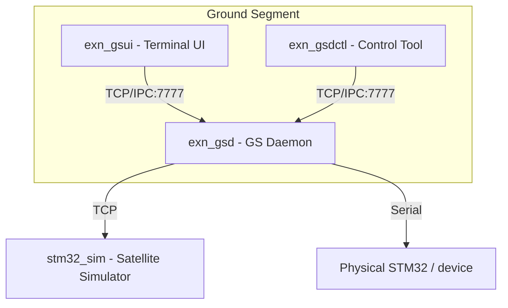

# EXN-GS

**EXN-GS** is the ground-control and hardware-in-the-loop environment for the EXN satellite-avionics demonstrator. It provides a C++17 daemon, terminal UI, command-line control tool, and STM32-oriented simulator for exercising CCSDS/PUS command and telemetry flows over Serial or TCP links.

> [!IMPORTANT]
> **Modernization status — 2026-08-31:** EXN-GS currently depends on the pre-v2 CCSDSPack integration model. Its fallback dependency configuration contains a developer-local absolute path, so a clean checkout is not reproducible unless a compatible CCSDSPack package is already installed. Migration to the released **CCSDSPack 2.x** package/API contract is tracked in [issue #2](https://github.com/ExoSpaceLabs/exn-gs/issues/2).

## Scope

EXN-GS is intended to provide a host-side integration boundary for EXN flight/payload software:

- command uplink and telemetry downlink;
- CCSDS packet framing and PUS packet handling;
- Serial and TCP device/simulator links;
- daemon-owned connection and state management;
- terminal-based monitoring and command entry;
- command-line automation/control;
- an STM32 communication simulator for development without physical hardware.

SpaceWire/SpWKit is **not currently an EXN-GS dependency**. If a SpaceWire transport is adopted later, it should be introduced as a separate, tested transport backend rather than implied by the current Serial/TCP implementation.

## Architecture



## Components

- **`exn_gsd`** — central ground-segment daemon:
  - owns Serial/TCP uplink and downlink;
  - handles CCSDS framing and PUS packet decoding;
  - maintains connection/state information and logging;
  - exposes the local IPC endpoint used by operator tools.
- **`exn_gsui`** — FTXUI-based terminal interface for real-time command/telemetry monitoring and operator interaction.
- **`exn_gsdctl`** — command-line control client for scripted or non-interactive daemon commands.
- **`stm32_sim`** — host-side simulator for exercising the device communication path without physical STM32 hardware.

## Dependencies

Current source baseline:

- CMake >= 3.20;
- C++17 compiler;
- Boost.System / Boost.Asio;
- FTXUI 5.0.0, fetched by CMake;
- CCSDSPack.

On Debian/Ubuntu:

```bash
sudo apt update
sudo apt install -y libboost-dev libboost-system-dev
```

### CCSDSPack dependency caveat

`cmake/deps.cmake` first tries `find_package(CCSDSPack)`. If no package is found, the current legacy fallback attempts to build CCSDSPack from `/home/dev/Works/CCSDSPack`, which is developer-specific and therefore not portable.

Until issue #2 is completed, configure EXN-GS only with a compatible CCSDSPack installation available to CMake. The modernization target is a versioned CCSDSPack 2.x package contract with no local filesystem assumptions.

## Build

```bash
cmake -S . -B build -DCMAKE_BUILD_TYPE=Release
cmake --build build -j
```

A successful clean-checkout build is part of the modernization acceptance criteria and should not rely on the legacy absolute-path fallback.

## Usage

### 1. Start the simulator

```bash
./build/sim/stm32_sim --listen 127.0.0.1:9000
```

### 2. Start the daemon

Connect to the simulator over TCP:

```bash
./build/daemon/exn_gsd --listen 127.0.0.1:7777 --port tcp://127.0.0.1:9000
```

Or connect to physical hardware over Serial:

```bash
./build/daemon/exn_gsd --listen 127.0.0.1:7777 --port /dev/ttyACM0 --baud 115200
```

### 3. Start the terminal UI

```bash
./build/ui/exn_gsui --connect 127.0.0.1:7777
```

UI controls:

- `c`: open command bar;
- `h`: toggle help overlay;
- `q`: quit;
- `Esc`: close the command bar or help overlay.

### 4. Use the control tool

```bash
./build/tools/gsdctl/exn_gsdctl ping
./build/tools/gsdctl/exn_gsdctl raw 0801C00000011101
```

## Common Daemon Commands

Commands can be entered through the UI command bar or sent through `exn_gsdctl`:

- `CONNECT` — open the configured device/simulator link;
- `DISCONNECT` — close the current link;
- `PING` — send a test PUS packet;
- `HK_REQ` — request housekeeping telemetry.

## Modernization Target

EXN-GS should be considered ready for the refreshed EXN baseline once:

1. it consumes a documented released CCSDSPack 2.x package;
2. no developer-local dependency paths remain;
3. clean-checkout CI builds and tests the installed-package integration;
4. CCSDS/PUS command and telemetry regressions pass against the v2 API;
5. the existing Serial/TCP simulator path remains validated;
6. any future transport backend, including possible SpWKit integration, is documented and tested as implemented scope.
