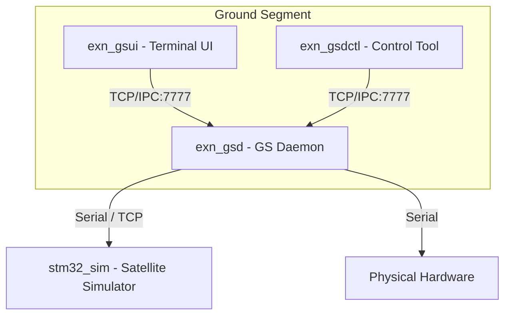

# exn-gs

Ground Segment TUI + daemon for STM32 CCSDS packets.

## System Overview

The `exn-gs` project provides a modular ground segment for communicating with STM32-based satellite systems using CCSDS packets over PUS (Packet Utilization Standard).

### Architecture



### Components

- **`exn_gsd`**: The central daemon. It handles:
    - Uplink/Downlink via Serial or TCP.
    - CCSDS framing and PUS packet decoding.
    - State management and logging.
    - IPC server for UI and control tools.
- **`exn_gsui`**: A terminal-based user interface using [FTXUI](https://github.com/ArthurSonzogni/FTXUI). Provides real-time TC/TM monitoring.
- **`exn_gsdctl`**: A command-line utility to send commands to the daemon without the UI.
- **`stm32_sim`**: A simulator that emulates a satellite's communication interface (sending telemetry, receiving commands).

## Build

### Dependencies
- Boost.System, Boost.Asio
- CMake >= 3.20
- A C++17 compiler (GCC/Clang)
- FTXUI (fetched automatically via CMake)

```bash
sudo apt update
sudo apt install -y libboost-dev libboost-system-dev
```

### Compilation

```bash
cmake -S . -B build -DCMAKE_BUILD_TYPE=Release
cmake --build build -j
```

## Usage

### 1. Start the Simulator
The simulator listens for a connection from the daemon.
```bash
./build/sim/stm32_sim --listen 127.0.0.1:9000
```

### 2. Start the Daemon
Configure the daemon to talk to the simulator (or a real serial port) and listen for GS clients.
```bash
# Connect to simulator via TCP
./build/daemon/exn_gsd --listen 127.0.0.1:7777 --port tcp://127.0.0.1:9000

# OR connect to real hardware via Serial
./build/daemon/exn_gsd --listen 127.0.0.1:7777 --port /dev/ttyACM0 --baud 115200
```

### 3. Start the UI
```bash
./build/ui/exn_gsui --connect 127.0.0.1:7777
```
**UI Controls:**
- `c`: Open command bar.
- `h`: Toggle help overlay.
- `q`: Quit.
- `Esc`: Close command bar or help.

### 4. Use the Control Tool
You can send commands directly to the daemon:
```bash
# Send a ping command
./build/tools/gsdctl/exn_gsdctl ping

# Send raw hex bytes (Command frame)
./build/tools/gsdctl/exn_gsdctl raw 0801C00000011101
```

## Common Daemon Commands
These can be typed into the UI command bar (`c` key) or sent via `exn_gsdctl`:
- `CONNECT`: Open the link to the device.
- `DISCONNECT`: Close the link.
- `PING`: Send a test PUS packet.
- `HK_REQ`: Request housekeeping data.
