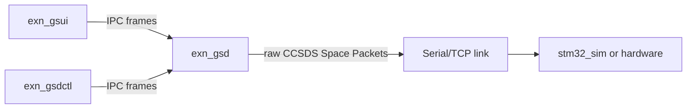

# EXN-GS architecture

## Responsibility split

### `exn_gsd`: transport/router

The daemon is the common point of connection between local GS applications and the current spacecraft/device transport.

It owns:

- Serial/TCP link lifecycle;
- CCSDS byte-stream framing;
- raw Space Packet forwarding in both directions;
- structural packet-boundary inspection for routing/logging;
- local connection state and packet history;
- JSONL logging;
- local multi-client IPC.

It intentionally does not own synchronous or periodic mission tasks. The daemon does not generate Housekeeping TCs, Time TCs, sequence counts, transaction IDs, or service schedules.

### `exn_gsui`: application/operator client

The UI is one application client of the daemon. It owns:

- CCSDSPack v2 TC construction;
- mission command sequencing;
- transaction/correlation IDs;
- periodic System HK scheduling;
- operator-triggered requests;
- presentation of routed TC/TM metadata.

Other future clients may use the same daemon without inheriting the UI's schedules.

### `exn_gsdctl`: automation/raw client

The command-line tool shares the daemon IPC. `ping` checks daemon/link state; `raw` submits a complete Space Packet through the same `PacketSend` route used by application clients.

### `stm32_sim`: endpoint simulator

The simulator represents the MCU endpoint on the TCP HIL link. It performs typed PUS-A TC parsing with CRC validation and generates CCSDSPack v2 PUS-A telemetry replies.

## Data path

## IPC model

IPC is length-prefixed:

`[u32_be length][u16_be message_type][payload...]`

Relevant message classes:

- `Hello` — daemon identity/session greeting;
- `LinkState` — current transport state;
- `PacketSend` — complete Space Packet supplied by a client for routing;
- `PacketTx` — metadata notification for a packet routed to the device link;
- `PacketRx` — metadata notification for a packet received from the device link;
- `Command` — daemon transport/control operation such as `CONNECT`, `DISCONNECT`, or `PING`;
- `Error` — rejected IPC request or packet-routing error.

The `PacketSend` payload is the complete CCSDS packet itself, not a daemon-specific mission command structure.
